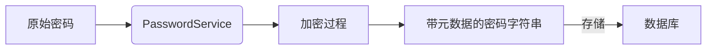
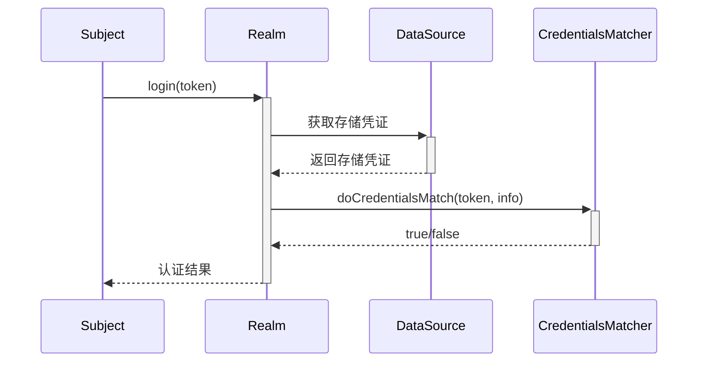
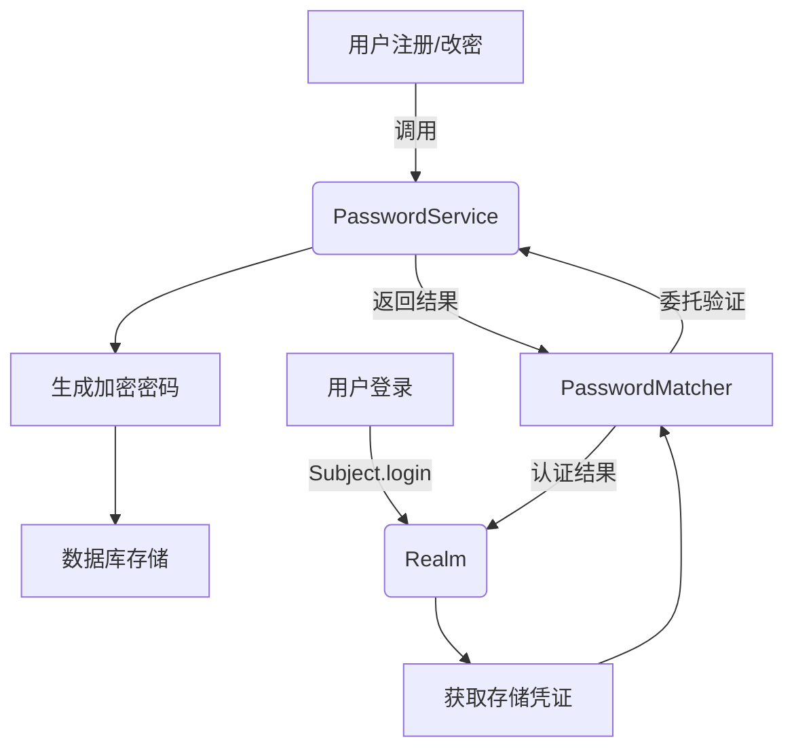

## Shiro密码格式
例如：$shiro1$SHA-512$500000$KugMUVDCPJtznITs7Y4hew==$NPMdHFqsOhL0USuvvyWOsP7gyQ1aYLG7G8Yc+ukSJzVJWgZks87F9wRomergZOGYhG6ddpEljjkWOs9ekMLbbA==
由以下部分组成：
- 算法标识符：$shiro1$
- 散列算法：SHA-512
- 迭代次数：500000
- 随机盐：KugMUVDCPJtznITs7Y4hew==
- 密文：NPMdHFqsOhL0USuvvyWOsP7gyQ1aYLG7G8Yc+ukSJzVJWgZks87F9wRomergZOGYhG6ddpEljjkWOs9ekMLbbA==
其中随机盐和密文均为Base64编码。

## Shiro密码加密的组件
在Shiro中，密码管理和验证涉及以下核心组件：**PasswordService**、**CredentialsMatcher** 和 **PasswordMatcher**。它们共同构成了 Shiro 的密码安全体系，各自承担不同的职责。下面我将详细解析它们的角色、关系和使用场景：

---
### 1. PasswordService - 密码加密服务
**职责**：负责密码的**加密**和**验证**  
**核心方法**：
```java
public interface PasswordService {
    // 加密原始密码
    String encryptPassword(Object plaintextPassword) throws IllegalArgumentException;
    
    // 验证提交的密码是否匹配存储的密码
    boolean passwordsMatch(Object submittedPlaintext, String encrypted);
}
```

**典型实现**：`DefaultPasswordService`  
**工作流程**：


**关键特性**：
- 自动生成随机盐值（salt）
- 生成包含完整元数据的密码字符串（算法/迭代次数/盐值/哈希值）
- 密码格式：`$shiro2$<algorithm>$<iterations>$<base64(salt)>$<base64(hash)>`
- 支持密码升级（自动检测旧格式并重新加密）

**配置示例**：
```java
DefaultHashService hashService = new DefaultHashService();
hashService.setHashAlgorithmName("SHA-256");
hashService.setHashIterations(500000);

DefaultPasswordService passwordService = new DefaultPasswordService();
passwordService.setHashService(hashService);
```

---

### 2. CredentialsMatcher - 凭证匹配器
**职责**：在认证过程中**比较用户提交的凭证**与**系统存储的凭证**  
**核心方法**：
```java
public interface CredentialsMatcher {
    boolean doCredentialsMatch(
        AuthenticationToken token, // 用户提交的凭证
        AuthenticationInfo info   // 系统存储的凭证
    );
}
```

**工作位置**：


**常见实现**：
| 实现类                | 用途                               |
|----------------------|-----------------------------------|
| `SimpleCredentialsMatcher` | 明文比对（仅用于测试）             |
| `HashedCredentialsMatcher` | 哈希密码比对（需配置相同哈希参数） |
| `PasswordMatcher`    | 委托给PasswordService进行验证      |

---

### 3. PasswordMatcher - 密码匹配器（特殊CredentialsMatcher）
**职责**：作为`CredentialsMatcher`的实现，**桥接认证过程**和`PasswordService`

**核心优势**：  
将密码验证逻辑**委托**给`PasswordService`，确保加密与验证使用**相同逻辑**

**源码关键逻辑**：
```java
public class PasswordMatcher implements CredentialsMatcher {
    private PasswordService passwordService;
    
    public boolean doCredentialsMatch(AuthenticationToken token, AuthenticationInfo info) {
        Object submitted = token.getCredentials(); // 用户提交的原始密码
        String encrypted = (String) info.getCredentials(); // 存储的加密密码
        return passwordService.passwordsMatch(submitted, encrypted);
    }
}
```

**配置示例**：
```java
@Bean
public Realm jdbcRealm(PasswordService passwordService) {
    JdbcRealm realm = new JdbcRealm();
    
    // 关键：使用PasswordMatcher桥接
    PasswordMatcher matcher = new PasswordMatcher();
    matcher.setPasswordService(passwordService); // 注入统一服务
    
    realm.setCredentialsMatcher(matcher);
    return realm;
}
```

---

### 三者的协作关系


---

### 最佳实践总结
1. **单一密码服务实例**  
   整个系统使用**同一个**`PasswordService`实例：
   ```java
   @Bean
   public PasswordService passwordService() {
       // 全局统一配置
   }
   ```

2. **认证层配置**  
   Realm 必须使用 `PasswordMatcher` 桥接：
   ```java
   @Bean
   public Realm realm(PasswordService passwordService) {
       var realm = new JdbcRealm();
       var matcher = new PasswordMatcher();
       matcher.setPasswordService(passwordService); // 关键注入
       realm.setCredentialsMatcher(matcher);
       return realm;
   }
   ```

3. **盐值处理**  
   当使用 `DefaultPasswordService` 时：
   - 数据库只需存储**单字段**（含完整元数据的密码字符串）
   - Realm 需设置为 `SaltStyle.EXTERNAL`或`SaltStyle.NO_SALT`
   
4. **密码升级策略**  
   在验证方法中处理旧密码：
   ```java
   public boolean passwordsMatch(Object submitted, String stored) {
       if (stored.startsWith("$shiro1$")) { // 检测旧格式
           boolean matched = legacyMatch(submitted, stored);
           if (matched) reencryptPassword(stored); // 升级密码
           return matched;
       }
       return defaultMatch(submitted, stored);
   }
   ```

---

### 常见错误规避
| 错误配置                          | 后果                  | 正确方案                         |
|----------------------------------|----------------------|----------------------------------|
| 多处创建PasswordService           | 加密/验证参数不一致   | 全局单例                         |
| 直接使用HashedCredentialsMatcher | 需手动同步盐/迭代参数 | 通过PasswordMatcher委托          |       |
| 数据库密码字段长度不足           | 截断存储导致验证失败  | VARCHAR(128+)                   |

通过正确理解这三个组件的职责和协作关系，可以构建出安全且一致的密码管理体系，避免常见的配置错误导致的认证问题。